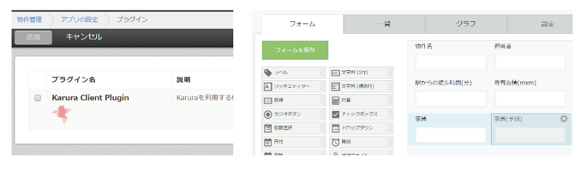
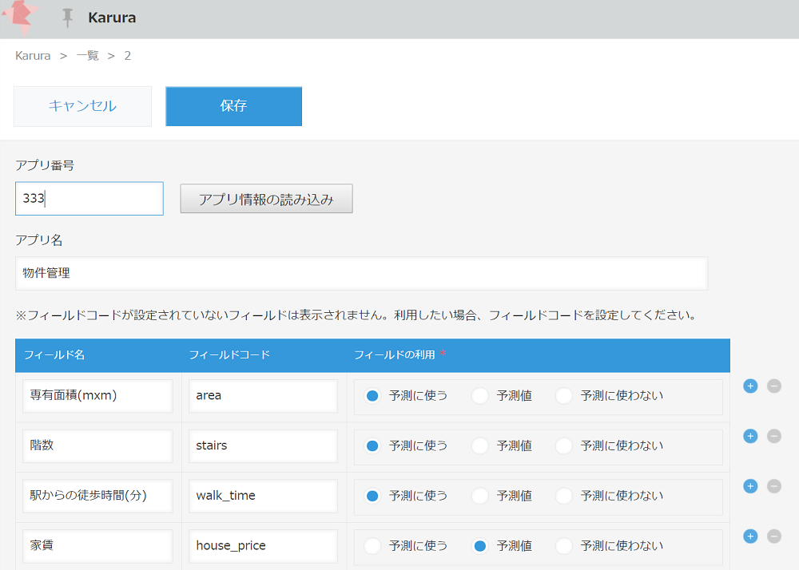
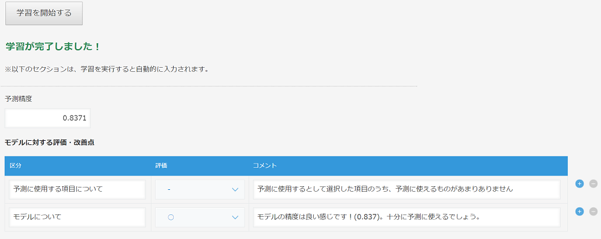
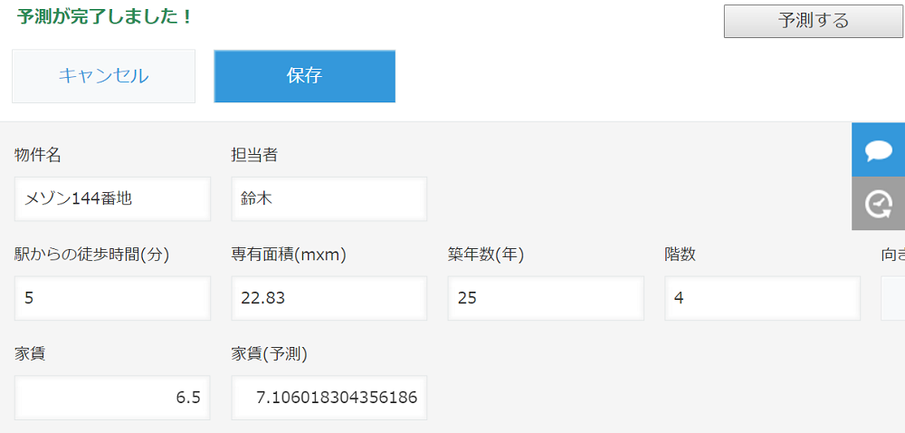

# karura

Easy machine learning platform on the kintone.

## All 3 steps to use prediction in your kintone app

Choose app that you want to do "prediction" (it is your client app). Then...

1. Add karura plugin to your client app, and add field to input predicted value.  
  
(if you have "price" field and you want to predict it, you have to add "price_prediction" field.)
2. Define prediction target, and items to use for prediction.  
  
You have to check your `app id`. You can confirm it in kintone system administration > app administration.
3. Train karura  

**Congraturation! You can use prediction in your client app!!**

## Installation

**for kintone**

* karura plugin
* karura master app
* karura server
 * if you want to host your own karura, you can deploy it by below heroku button.

